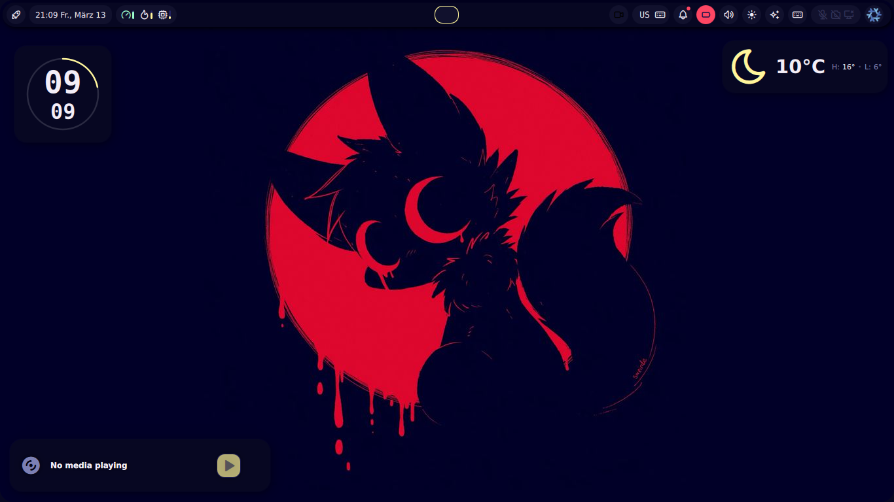
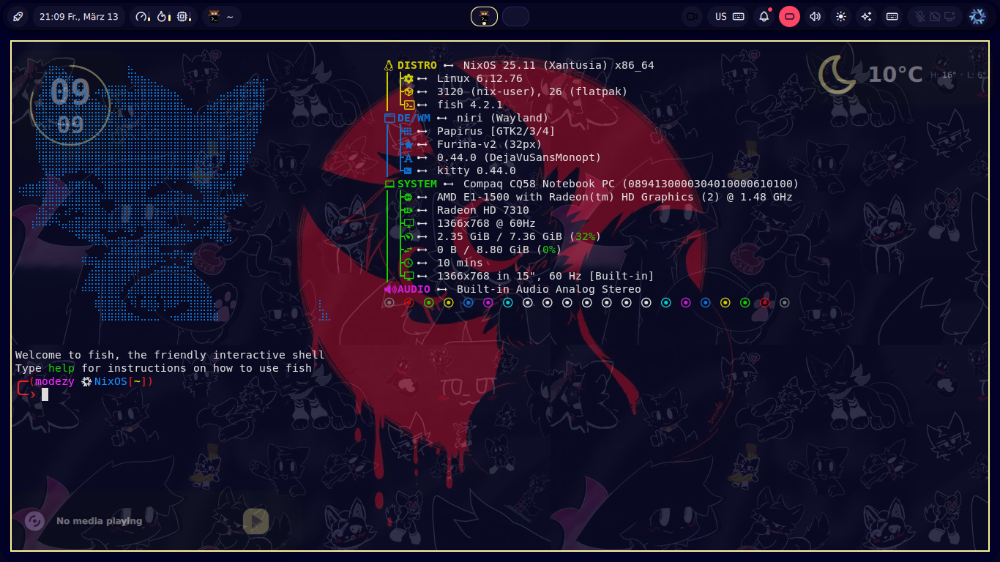

# NixOS-Noctalia

My personal NixOS configuration.

> *My first "rice", by the way.*

---

## Installation

```bash
git clone https://github.com/EineFrau/NixOS-Noctalia
cd NixOS-Noctalia
cp ./configs/* ~/.config/
```

Home Manager and `configuration.nix` can be installed however you prefer.

If you're a beginner, you can simply run:
> [!IMPORTANT]
> Replece usernames in `./nixos/configuration.nix`, and `./home-manager/home.nix`


```bash
./autoinstall.sh
```

---

## Preview




## Terminal alias

| bind | command |
| ----- | ----- |
| ns | sudo nixos-rebuild switch |
| hs | home-manager switch |
| hsb | home-manager switch -b backup |
| nh | open home config in nvim |
| c | clear |
| n | nvim |
| gc | git clone |
| gs | git status |
| gd | git diff |
